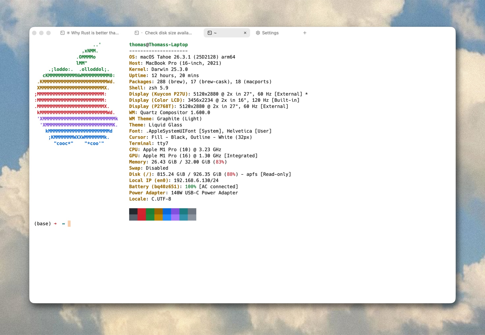

### tty7

**纯 Rust 编写的高性能 GPU 渲染终端。**

GPU 渲染基于 Zed 的 gpui · VT 内核来自 Alacritty

 

[**安装**](#-安装) · [**基准测试**](#-基准测试) · [**快捷键**](#️-快捷键) · [**参与贡献**](#-参与贡献)

[English](README.md) · 简体中文

 

 

tty7 是一款 GPU 渲染的终端。11 MB 的 `cat` 仅需 **95 ms**，大约是
Alacritty、Ghostty、Kitty 的两倍速度（同一台机器）；内置提示符提供内联补全、
语法高亮，以及常用命令的逐 flag 说明。纯 Rust 编写，macOS、Windows、Linux
均为原生构建，无需额外配置。

- ⚡ **快** —— 11 MB 的 `cat` 只花 **95 ms**，Alacritty/Ghostty/Kitty
  要 179–239 ms；DOOM-fire 跑到 **888 fps**，它们在 485–617 之间。同一台机器、
  同一网格测出来的，脚本就在仓库里（见[基准测试](#-基准测试)）。
- ⌨️ **带补全的提示符** —— 内联补全、语法高亮、历史记录、终端内搜索。输入 `git commit --`、`kubectl` 或 `npm`，每个 flag 和子命令
  都会带着说明一并列出 —— 覆盖约 100 个常用命令，数据取自 Fig 的语料。
- 🧠 **懂 shell，零配置** —— 新标签页和分屏都开在当前目录，路径补全也始终跟随
  你所在的位置。zsh、bash、fish、PowerShell 均自动接入，开箱即用。
- 🔌 **会话不中断** —— shell 运行在后台守护进程中，关窗口、退应用、乃至换上新
  版程序，都不会中断任何一个 shell。随时断开，随时接回，无需 tmux。

其他功能：标签页（拖拽重排、双击重命名、数字键切换）、可拖动分隔线
调节比例的分屏、命令面板、点击打开链接、桌面通知、焦点随鼠标移动。内置 8 套
主题（由浅及深），系统标题栏的明暗跟随所选主题；CJK 与输入法组合输入也一并
支持。

macOS、Windows、Linux 三个平台都有原生构建，每个 release 一起打出。

 

**[下载最新版本&nbsp;&nbsp;▶](https://github.com/l0ng-ai/tty7/releases/latest)**

 

## 📊 基准测试

四款终端在同一台机器上一口气测完，网格统一为 155×40 —— Apple M1 Pro，
macOS 26.3.1，取五次运行的平均值（2026-07-04）：

| | **tty7** | Alacritty | Ghostty | Kitty |
|---|---:|---:|---:|---:|
| 纯文本 IO —— 11 MB `cat` （越低越好） | **95 ms** | 239 ms | 179 ms | 185 ms |
| [DOOM-fire](https://github.com/const-void/DOOM-fire-zig) 帧率 （越高越好） | **888 fps** | 485 fps | 552 fps | 617 fps |
| 冷启动内存 | 116 MB¹ | 105 MB | 128 MB | 130 MB |

¹ GUI 105 MB + 常驻守护进程 11 MB。

tty7 以设备速度读取 PTY，并在渲染路径之外成批解析输出，热路径全程无锁 ——
再大的 `cat` 也不会阻塞在渲染上。（后台守护进程亦服务于此：触发背压前，它最多
可领先窗口 16 MiB。）

测试方法（每款终端怎么驱动、网格是否公平、有哪些坑）连同一键复现脚本，都放在
[`scripts/bench/`](scripts/bench/README.md)，欢迎自己跑一遍。

## 🚀 安装

到 [**Releases**](https://github.com/l0ng-ai/tty7/releases) 下载对应平台的构建：

- **macOS** —— `tty7-<version>-macos-arm64.dmg`（Apple Silicon）或 `…-x86_64.dmg`
  （Intel）；打开后把 `tty7.app` 拖进「应用程序」即可。
- **Windows** —— `…-windows-x86_64.zip`；解压后运行 `tty7.exe`。
- **Linux** —— `…-linux-x86_64.tar.gz`；解压后运行 `./tty7`（需要常见的
  x11/wayland 运行时库）。

## ⌨️ 快捷键

下表按 macOS 记法书写 —— 在 Windows 和 Linux 上，把 <kbd>⌘</kbd> 读作
<kbd>Ctrl</kbd>。按 <kbd>⌘ ,</kbd> 打开设置，可查看或重新映射全部键位。最常用的几个：

| | |
|---|---|
| <kbd>⌘ T</kbd> · <kbd>⌘ W</kbd> · <kbd>⌘ ⇧ T</kbd> | 新建标签页 · 关闭标签页 · 恢复关闭的标签页 |
| <kbd>⌘ D</kbd> · <kbd>⌘ ⇧ D</kbd> | 向右分屏 · 向下分屏 |
| <kbd>⌘ ]</kbd> · <kbd>⌘ [</kbd> | 下一个窗格 · 上一个窗格 |
| <kbd>⌘ ⏎</kbd> · <kbd>⌘ ⇧ ⏎</kbd> | 切换全屏 · 最大化 / 还原窗格 |
| <kbd>⌘ K</kbd> | 清屏并清空回滚缓冲区 |
| <kbd>⌘ P</kbd> | 命令面板 |
| <kbd>⌘ F</kbd> | 搜索回滚缓冲区 |
| <kbd>⌃ R</kbd> | 反向搜索 shell 历史 |
| <kbd>⌘ +</kbd> · <kbd>⌘ −</kbd> · <kbd>⌘ 0</kbd> | 字号增大 · 减小 · 重置 |

完整列表（以及你改过的自定义键位）在 **Settings → Keybindings**。

## 💭 站在这些之上

- [gpui](https://github.com/zed-industries/zed) —— Zed 的 GPU 加速 UI 框架
- [`alacritty_terminal`](https://github.com/zed-industries/alacritty)（Zed 的 fork）—— VT 模拟器、网格与 PTY
- [gpui-component](https://github.com/longbridge/gpui-component) —— UI 组件，经由一个[固定版本的 fork](https://github.com/l0ng-ai/gpui-component/tree/tty7)
- [tmux](https://github.com/tmux/tmux) —— 常驻守护进程设计的灵感来源

## 🤝 参与贡献

欢迎提 bug 和 PR。安全问题请走 [SECURITY.md](SECURITY.md)；重要改动都记在
[CHANGELOG](CHANGELOG.md)。

## 📝 许可证

[Apache License 2.0](LICENSE) · © 2026 l0ng-ai

 

<b>tty7</b> —— 纯 Rust 编写的高性能 GPU 渲染终端。

